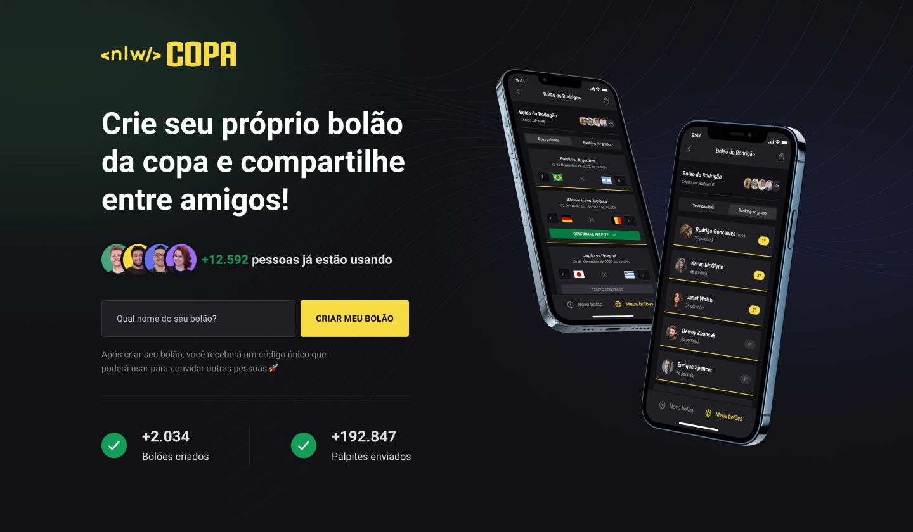

  

## 💻 Projeto

Aplicação para participar de bolões da Copa do Mundo 2022,onde foram adicionadas novas funcionalidades para a aplicação como entrar com o google, pagina de listagem de bolões e pagina de detales dos bolões.

## ✨ Tecnologia

- [TypeScript](https://www.typescriptlang.org/)
- [React](https://reactjs.org/)
- [Fastify](https://www.fastify.io/)
- [Prisma](https://www.prisma.io/)
- E muitas outras…

## 🚀 Como executar

Em todos os projetos, ao acessar a pasta, é preciso baixar os pacotes com o gerenciador de sua preferencia.

Acesse a documentação de cada projeto:

- [Backend](./server/README.md)
- [Web](./web/README.md)

## 🔖 Layout

Você pode visualizar o layout do projeto através do link abaixo:

- [Layout](https://www.figma.com/community/file/1169028343875283461)

Lembrando que você precisa ter uma conta no [Figma](http://figma.com/).

